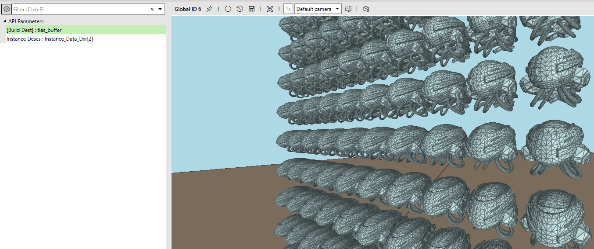
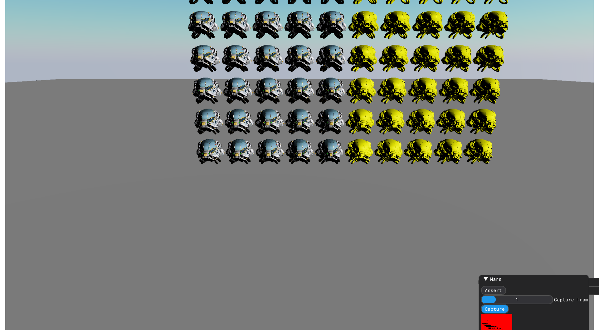
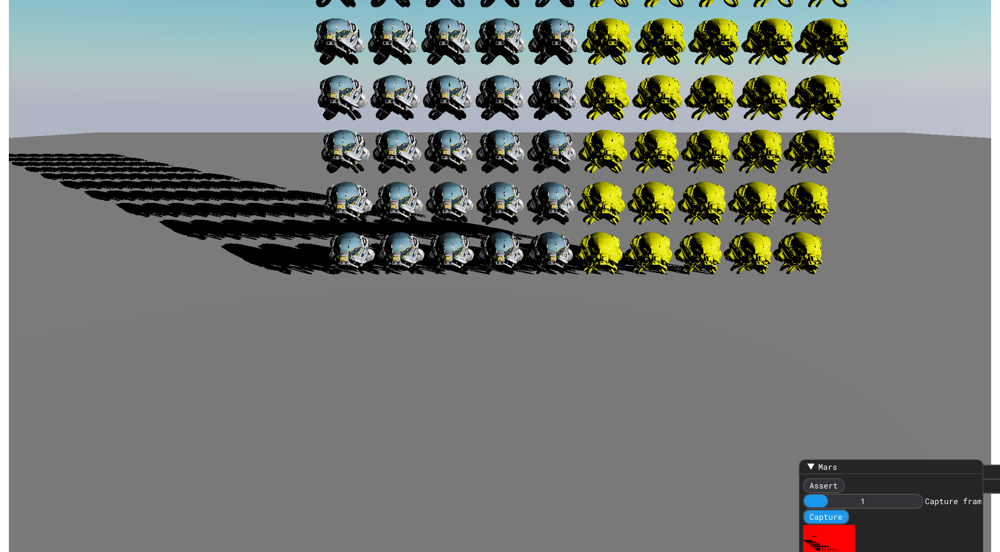

# JAI & DX12 - so DXR is coming!

## Introduction
Recently I started playing with a new language called `jai`. After writing few simple programs, I wanted to try something a little bit serious. I asked myself why not to write renderer once again, avoiding mistakes from the past :)

As jai language is focused on writing the code only in procedural way, it doesn't have concept of constructors, destructors nor inheritance, hence no virtual functions.
So as DirectX api is strongly focused on OOP features, there is a small problem how to talk with DX12 api...
Fortunately, while I was starting the project, compiler team had worked hard on bindings generator for jai, and after some time I was able to generate proper bindings for DX12 automatically.
Virtual functions have become an array of pointers to functions, and fortunately for me - all API objects are created inside DX12 dlls, so I don't need to care about filling vtables :)  
All bindings are available here https://github.com/wgrzelczak/jai-d3d12

To make usage of virtual functions nicer, there was introduced `vtable` helper function.
So something which is written in C++ as 
```cpp
device->CheckFeatureSupport(D3D12_FEATURE::D3D12_OPTIONS5, &features, size_of(D3D12_FEATURE_DATA_D3D12_OPTIONS5));
```
is written in jai like
```
vtable(device).CheckFeatureSupport(device, .D3D12_OPTIONS5, *features, size_of(D3D12_FEATURE_DATA_D3D12_OPTIONS5));
```

Current state of the renderer is rather basic. I am using dynamic resources from SM6.6 for all model textures, and static descriptor table for backend resources.
And here is brief overview of a frame:
* execute immediate command list
* init:
  * update lights structured buffer
  * update instances buffer (mostly matrices)
  * update dirty materials buffer
* deferred pass
* deferred resolve
* forward pass (only skybox for now)
* tonemapping
* imgui pass

## So it begins...
Note that this is my first attempt to implement raytracing from scratch and it won't be optimal for sure.

First of all - few great links with materials which helped me a lot while doing this:  
https://developer.nvidia.com/blog/ray-tracing-essentials-part-1-basics-of-ray-tracing/  
https://gpuopen.com/learn/hybrid-shadows/  
https://microsoft.github.io/DirectX-Specs/d3d/Raytracing.html  
https://developer.nvidia.com/blog/rtx-best-practices/  

Now when having some background we can specify few goals for this task:
* renderer will support shadows for one directional light (sun)
* shadows may be hard and not physically accurate in case of energy conservation
* (optional) `TraceRayInline` should simplify the code massively
* (optional) BLASes should be reused for the same piece of geometry

## Initialization
DXR doesn't need much preinitialization for the device, but as we want to use DXR we probably want to check if our device is supporting it.
```
    features5 : D3D12_FEATURE_DATA_D3D12_OPTIONS5;
    vtable(device).CheckFeatureSupport(device, .D3D12_OPTIONS5, *features5, size_of(type_of(features5)));
    if features5.RaytracingTier < ._1_1 {
        print("[ERROR] DXR v1.1 not supported!\n");
        assert(false);
    } else {
        print("DXR version: D3D12_RAYTRACING_TIER%\n", features5.RaytracingTier);
    }
```

## Creating BLASes
When we load the model we want to create BLAS for each mesh in similar way we create vertex and index buffer. And as the project is small we don't need to defer creation of BLASes, so we can create them in immediate command list.
```
Mesh_View :: struct {
    vertices_address : u64;
    vertices_count   : u32;
    vertices_stride  : u8;
    
    indices_address  : u64;
    indices_count    : u32;
    indices_stride   : u8;
    
    blas_view        : Blas_View;
}

Blas_View :: struct {
    scratch : Buffer;
    buffer  : Buffer;
}

renderer_create_mesh :: (name : string) -> Asset_Handler {
    using gfx;
    //
    // Check cache
    handler := create_asset_handler(name);
    cached := table_find_pointer(*meshes, handler);
    if cached return handler;
    
    //
    // Add entry to cache and load mesh from file
    mesh := table_add(*meshes, handler, .{});
    <<mesh = load_from_file(name);
    
    //
    // Create BLAS
    dxr_init_blas(immediate_command_list, mesh);
    
    return handler;
}
```

Now the meat of BLASes creation. Firstly we need to create geometry description. Most of parameters are descriptions of our vertex and index buffers.
Transform3x4 we can set to 0, as we don't want to add any transform for base meshes, but it is possible here by passing `D3D12_GPU_VIRTUAL_ADDRESS` pointer to gpu buffer with 3x4 matrix.
Flags field we set to `.OPAQUE`, as the renderer doesn't support any transparency.

Next step is defining acceleration structure's inputs. For now everything is in basic configuration - BLAS is requested only for one mesh, and as BLAS won't be rebuilt, Flags is set to `.PREFER_FAST_TRACE`. Note that BLAS might be rebuilt for skeletal meshes when mesh is deformed, and then we need to set this to `.ALLOW_UPDATE`.

After creating buffers and filling one more struct we can schedule the command for building BLAS. And first part is done!
```
dxr_init_blas :: (cmd_list : Command_List, mesh : *Mesh_View) {
    blas : Blas_View;
    
    using context.dx12;
    geometry_desc : D3D12_RAYTRACING_GEOMETRY_DESC;
    geometry_desc.Type                                 = .TRIANGLES;
    geometry_desc.Triangles.VertexBuffer.StartAddress  = mesh.vertices_address;
    geometry_desc.Triangles.VertexBuffer.StrideInBytes = mesh.vertices_stride;
    geometry_desc.Triangles.VertexCount                = mesh.vertices_count;
    geometry_desc.Triangles.VertexFormat               = .R32G32B32_FLOAT;
    geometry_desc.Triangles.IndexBuffer                = mesh.indices_address;
    geometry_desc.Triangles.IndexCount                 = mesh.indices_count;
    geometry_desc.Triangles.IndexFormat                = .R16_UINT;
    geometry_desc.Triangles.Transform3x4               = 0;
    geometry_desc.Flags                                = .OPAQUE;
    
    as_inputs : D3D12_BUILD_RAYTRACING_ACCELERATION_STRUCTURE_INPUTS;
    as_inputs.Type           = .BOTTOM_LEVEL;
    as_inputs.DescsLayout    = .ARRAY;
    as_inputs.pGeometryDescs = *geometry_desc;
    as_inputs.NumDescs       = 1;
    as_inputs.Flags          = .PREFER_FAST_TRACE;
    
    as_build_info : D3D12_RAYTRACING_ACCELERATION_STRUCTURE_PREBUILD_INFO;
    vtable(device).GetRaytracingAccelerationStructurePrebuildInfo(device, *as_inputs, *as_build_info);
    
    buffer_flags := Buffer.Flags.MEMORY_DEFAULT | .ADD_UAV;
    blas.scratch = renderer_create_buffer("blas_scratch", as_build_info.ScratchDataSizeInBytes,   1, buffer_flags);
    blas.buffer  = renderer_create_buffer("blas_buffer",  as_build_info.ResultDataMaxSizeInBytes, 1, buffer_flags, initial_state = .RAYTRACING_ACCELERATION_STRUCTURE);
    
    desc : D3D12_BUILD_RAYTRACING_ACCELERATION_STRUCTURE_DESC;
    desc.Inputs                           = as_inputs;
    desc.ScratchAccelerationStructureData = GetGPUVirtualAddress(blas.scratch);
    desc.DestAccelerationStructureData    = GetGPUVirtualAddress(blas.buffer);
    
    cl : *ID3D12GraphicsCommandList4;
    check_hr(vtable(cmd_list.dx12).QueryInterface(cmd_list.dx12, *uid(ID3D12GraphicsCommandList4_UUID), xx *cl));
    defer safe_release(cl);
    
    vtable(cl).BuildRaytracingAccelerationStructure(cl, *desc, 0, null);
    mesh.blas_view = blas;
}
```

## Creating TLAS
This part is a bit more complicated. We need to update World matrices of all meshes. Yes, we could update only dirty matrices, but in will add complexity and we want to produce rays ASAP :).

First things first - we need to create buffer for model matrices for each frame in flight.
```
    Tlas_View :: struct {
        scratch : Buffer;
        buffer  : Buffer;
    }

    // Global context:
    instance_data_dxr     : [NUM_BACKBUFFERS] Buffer;
    tlas                  : Tlas_View;
    tlas_inputs           : D3D12_BUILD_RAYTRACING_ACCELERATION_STRUCTURE_INPUTS;
    tlas_build_info       : D3D12_RAYTRACING_ACCELERATION_STRUCTURE_PREBUILD_INFO;

    // Resource initialization:
    for *instance_data_dxr {
        name := tprint("Instance_Data_Dxr[%]", it_index);
        <<it = renderer_create_buffer(name, Instance_Data_Buffer_Count,  size_of(D3D12_RAYTRACING_INSTANCE_DESC), Buffer.Flags.MEMORY_DYNAMIC | .HAS_SRV, .GENERIC_READ); 
    }
```

Now we can create TLAS. Note, that TLAS may reuse buffer from previous frame, as it will be updated only on GPU - so we don't need to create one of them for each frame in flight.
The most important thing which for creating TLAS buffer and TLAS scratch buffer is number of submeshes. We can omit recreating buffer if number of meshes haven't changed.
```
    dxr_prebuild_tlas_helper :: (tlas : *Tlas_View, submeshes_count : u32) {
        if tlas_inputs.NumDescs == submeshes_count
            return;
        
        tlas_inputs.Type           = .TOP_LEVEL;
        tlas_inputs.DescsLayout    = .ARRAY;
        tlas_inputs.InstanceDescs  = 0; //Note: this field will be filled later, it's not needed for verifying size of the buffers
        tlas_inputs.NumDescs       = submeshes_count;
        tlas_inputs.Flags          = .PREFER_FAST_TRACE;
        
        using context.dx12;
        vtable(device).GetRaytracingAccelerationStructurePrebuildInfo(device, *tlas_inputs, *tlas_build_info);
        
        renderer_release_buffer(*tlas.scratch);
        renderer_release_buffer(*tlas.buffer);
        
        buffer_flags := Buffer.Flags.MEMORY_DEFAULT | .ADD_UAV;
        tlas.scratch = renderer_create_buffer("tlas_scratch", tlas_build_info.ScratchDataSizeInBytes,   1, buffer_flags);
        tlas.buffer  = renderer_create_buffer("tlas_buffer",  tlas_build_info.ResultDataMaxSizeInBytes, 1, buffer_flags, initial_state = .RAYTRACING_ACCELERATION_STRUCTURE);
    }
```

At the beginning we need to prebuild/precreate the tlas buffers which will hold information about all submeshes transforms.
After that we populate `instance_data_dxr` buffer with `D3D12_RAYTRACING_INSTANCE_DESC` entries.
All first structure members: `InstanceID`, `InstanceMask`, `InstanceContributionToHitGroupIndex` and `Flags`, representing values which will be used as parameters in shaders to trace rays, or will be returned on ray hit.
As we want to trace only shadows, we won't need anything about materials or instances. Later we will see usage of all those parameters and we will be able to tweak them for specific usage, but for now we can set them to basic values.
Last thing for instance description is transform matrix. The same way as it is needed for rasterisation passes - World = Translation * Rotation * Scale. Haveing the buffer filled we can schedule updating it.
And now when GPU will have it's data ready to use, we schedule `BuildRaytracingAccelerationStructure`.
```
    dxr_build_tlas :: (tlas : *Tlas_View, cmd_list : Command_List, entities :[] *Entity){
        using context.dx12;
        
        //
        // Sum number of all submeshes and update tlas buffers if needed
        count : u32 = 0;
        for entities count += cast(u32)it.model.submeshes.count;
        dxr_prebuild_tlas_helper(tlas, count);
        
        //
        // Prepare scene geometry
        instances : [..] D3D12_RAYTRACING_INSTANCE_DESC;
        array_reserve(*instances, count);
        for e : entities {
            for mesh : e.model.submeshes {
                i : D3D12_RAYTRACING_INSTANCE_DESC;
                i.InstanceID = xx it_index;
                i.InstanceMask |= 0xff << 24;
                i.InstanceContributionToHitGroupIndex = 0;
                i.Flags        |= 0 << 24;
                
                //@Cleanup Merge with renderer loop
                translation := make_translation_matrix4(e.translation);
                rotation    := rotation_matrix(Matrix4, e.rotation);
                scale       := make_scale_matrix4(e.scale);
                W           := translation * rotation * scale;
                
                //@Cleanup
                for r : 0..3 {
                    for c : 0..2 {
                        i.Transform[c][r] = W.coef[c][r];
                    }
                }
                mesh_view := table_find_pointer(*gfx.meshes, mesh);
                i.AccelerationStructure = GetGPUVirtualAddress(mesh_view.blas_view.buffer);
                array_add(*instances, i);
            }
        }

        //
        // Copy instances data to gpu
        command_update_buffer(cmd_list, *gfx.instance_data_dxr[gfx.frame_idx], array_view_u8(instances));
        
        //
        // Schedule building TLAS
        tlas_inputs.InstanceDescs = GetGPUVirtualAddress(gfx.instance_data_dxr[gfx.frame_idx]);
        desc : D3D12_BUILD_RAYTRACING_ACCELERATION_STRUCTURE_DESC;
        desc.Inputs                           = tlas_inputs;
        desc.ScratchAccelerationStructureData = GetGPUVirtualAddress(tlas.scratch);
        desc.DestAccelerationStructureData    = GetGPUVirtualAddress(tlas.buffer);
        
        cl : *ID3D12GraphicsCommandList4;
        check_hr(vtable(cmd_list.dx12).QueryInterface(cmd_list.dx12, *uid(ID3D12GraphicsCommandList4_UUID), xx *cl));
        defer safe_release(cl);
        
        vtable(cl).BuildRaytracingAccelerationStructure(cl, *desc, 0, null); 
    }
```

And last thing - calling our function. I didn't measure anything yet, but putting it at the end of frame preparation is a reasonable place, at least for now.
```
// renderer init phase
/// ...
dxr_build_tlas(command_list, models_to_draw); 

// render deferred phase...
```

And we are done with acceleration structures. If we run the pix and we grab a frame we should get a view with TLAS.



## DXR shadows preparation

As we want a handle for TLAS in shader, we need to add a descriptor to our root signature, register in shader and call resource binding.

In our case TLAS will be bound to root signature as 4th parameter. And for simplicity we can set register space to something else than 0.
```
    // Root signature description

    // 4: DXR
    //    SRV TLAS
    array_add(*root_signature_desc.params, make_descriptor(.SRV, .All, t(0), space(2)));
    dx12_create_root_signature(*gfx.default_root_signature, root_signature_desc);
    
```

In HLSL, we need to add only one line with resource definition.
```hlsl
    RaytracingAccelerationStructure dxr_tlas : register(t0, space2);
```

And lastly - binding TLAS to root signature in runtime.
```

    command_bind_tlas :: (using ctx : Command_List, tlas : Tlas_View, rs_param_idx : u32) {
        gpu_location := GetGPUVirtualAddress(tlas.buffer);
        vtable(dx12).SetGraphicsRootShaderResourceView(ctx.dx12, rs_param_idx, gpu_location);
    }

    command_bind_tlas_cs :: (using ctx : Command_List, tlas : Tlas_View, rs_param_idx : u32) {
        gpu_location := GetGPUVirtualAddress(tlas.buffer);
        vtable(dx12).SetComputeRootShaderResourceView(ctx.dx12, rs_param_idx, gpu_location);
    }


    //
    // Prepare root signature:
    command_set_root     (command_list, default_root_sig);
    command_set_root_cs  (command_list, default_root_sig);
    ...    
    command_bind_tlas    (command_list, tlas, 4);
    command_bind_tlas_cs (command_list, tlas, 4);
```

Now while we have bindings ready, we can create shadowmap texture.
For now we will waste a lot of memory by creating 16 bits per texel in full resolution, as we need only 1 bit.
And as default SRV we set to base descriptor for engine resources with `IDX_SHADOWMAP` offset. Note that we have already bound descriptor table for engine resources, so we don't need to do this explicitly here.
```
    // Global context:
    shadowmap     : Texture;
    
    
    // Resource initialization:
    IDX_SHADOWMAP :: 11;
    shadowmap      = renderer_create_texture("shadowmap",
                                            width_full, height_full, .R16_FLOAT,
                                            flags = Texture.Flags.ADD_UAV | .ADD_SRV,
                                            default_srv = offset(desc_base, IDX_SHADOWMAP));
```

## DXR shadows renderpass and shader
For renderpass we need at least default compute shader PSO with our shader. And we call init function on renderer init, and release renderpass on renderer shutdown.
```
    dxr_shadows_pso : PSO;
    init_renderpass_dxr_shadows :: () {
        desc : PSO_Desc;
        desc.shader_name = "dxr_shadows.hlsl";
        pso = dx12_create_pso_cs(desc);
    }

    release_renderpass_dxr_shadows :: () {
        safe_release(pso.dx12);
    }
```


As we are using compute shader, we can scalarize work and use GPU in 8x8x1 thread configuration to utilize as much threads as we can.
```
    DXR_SHADOWS_TILE_X :: 8;
    DXR_SHADOWS_TILE_Y :: 8;
    renderpass_dxr_shadows :: (ctx : Command_List) {
        using gfx;
        
        assert(shadowmap.width  % DXR_SHADOWS_TILE_X == 0);
        assert(shadowmap.height % DXR_SHADOWS_TILE_Y == 0);
        x := shadowmap.width  / DXR_SHADOWS_TILE_X;
        y := shadowmap.height / DXR_SHADOWS_TILE_Y;
        
        command_scope_event(command_list, "dxr_shadows");
        command_bind_table_cs(ctx, shadowmap.uav, default_root_sig.param_idx_user_srv_cbv_uav);
        
        command_barrier(ctx, shadowmap, .PIXEL_SHADER_RESOURCE, .UNORDERED_ACCESS); 
        command_dispatch(ctx, dxr_shadows_pso, x, y, 1);
        command_barrier(ctx, shadowmap, .UNORDERED_ACCESS, .PIXEL_SHADER_RESOURCE);
    }
```

Instead of casting rays from light, it should be faster (I haven't measured yet) to trace ray from the object to light position - rays will be shorter if we use direcional light in max distance.
To achieve this we need depth buffer. We don't have any depth prepass for forward rendered objects, but for now we can use depth buffer from gbuffer geometry pass. The place of tracing rays is not ideal, but it satifies me for now.

```
    //
    // GBuffer geometry
    for models_to_draw {
        for submesh, submesh_idx : it.model.submeshes {
            ...
            command_draw_mesh(command_list, cast(u16)it_index, submesh.mesh, submesh.material);
        }
    }
    ...
    
    //
    // DXR Shadows
    {
        //TODO(nyv): move before geometry pass (after we have prepass active)
        renderpass_dxr_shadows(command_list);
    }
    
    //
    // GBuffer resolve
    ...
```


And finally the shader.
```hlsl
    #include "preinclude.hlsli" //global resources, gbuffer, lights, etc.

    //
    // Helper function for reconstructing world position from depth
    float3 reconstruct_w_pos(float2 uv, float depth) {
        //
        // Calulated using base camera near and far
        float A = far / (far-near);
        float B = (-far*near) / (far-near);

        float linear_depth = B / (depth - A);

        uv.y = 1.0 - uv.y;

        float4 cs_position = float4(uv * 2.0 - 1.0, depth, linear_depth);
        cs_position.xyz *= cs_position.w;
        float4 vs_position = mul(cs_position, PInv);
        float4 ws_position = mul(vs_position, VInv);
        return ws_position.xyz;
    }

    RWTexture2D<float> out_shadowmap : register(u0);

    [numthreads(DXR_SHADOWS_TILE_X, DXR_SHADOWS_TILE_Y, 1)]
    void main_cs(uint3 global_id  : SV_DispatchThreadID,
                 uint3 local_id   : SV_GroupThreadID,
                 uint  local_idx  : SV_GroupIndex,
                 uint3 group_id   : SV_GroupID) {
        
        //
        // Get UV
        uint2 coord = global_id.xy;
        float2 uv = float2((float)global_id.x / rendertarget_width, (float)global_id.y / rendertarget_height);
        
        //
        // Early return if any object was rendered to depth buffer
        float depth = gbuffer_depth[coord].r;
        if(depth == 1.0)
            return;
        
        //
        // Reconstruct world position from depth
        float3 world_pos = reconstruct_w_pos(uv, depth);
        
        //
        // Ray description
        RayDesc ray;
        ray.Origin = world_pos;
        ray.TMin = 1;
        ray.Direction = normalize(get_light_position(0));
        ray.TMax = 10000.0;
        
        RayQuery<RAY_FLAG_CULL_NON_OPAQUE |
            RAY_FLAG_SKIP_PROCEDURAL_PRIMITIVES |
            RAY_FLAG_ACCEPT_FIRST_HIT_AND_END_SEARCH> q;

        q.TraceRayInline(dxr_tlas,
                         RAY_FLAG_ACCEPT_FIRST_HIT_AND_END_SEARCH | RAY_FLAG_SKIP_CLOSEST_HIT_SHADER | RAY_FLAG_SKIP_PROCEDURAL_PRIMITIVES,
                         0xff, // masking objects by InstanceMask which was set while building TLAS
                         ray);
        //
        // Execute trace
        q.Proceed();
        
        //
        // Set 0.0 if we hit something, and object should be shadowed.
        float colour = 1.0;
        if(q.CommittedStatus() == COMMITTED_TRIANGLE_HIT)
        {
            color = 0.0;
        }
        
        out_shadowmap[coord] = colour;
}
```

And finally in gbuffer resolve and forward passes we can sample shadowmap texture:
```hlsl
    float shadow = shadowmap.Sample(sampler_default, input.uv).r;
    colour *= shadow;
```


And here they are - first DXR shadows.
  


## Summary
I think we can all agree that for that much signifficant work result is... let's say not ideal.

And here few things which come to my mind and which should be fixed or added:
* Visual
  * soft shadows
* Engine
  * proper support for forward rendered objects (now only deferred objects casts shadows)
  * more dynamic interfaces for transparent objects and for skeletal meshes
  * support shadows for multiple lights
* Performance/Memory
  * utilizing (Re)BAR memory for TLAS
  * compressing shadowmaps - for example using uint8 for 8 texels

If you have any questions or comments, let me know in github message or this page github issues.
